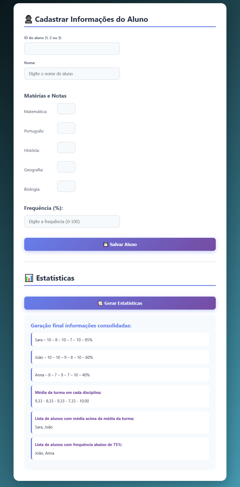

# 🎓 Sistema de Gerenciamento de Notas - Gestor Acadêmico 

Front-end:

* React
* Javascript
* CSS / Estilização Própria
* Api de integração

# Backend 

* Framework Flaks
* Python

📸 Demostração

## Como executar o projeto localmente

    git clone https://github.com/AlexadraCampos/sistema_de_gerenciamento_de_notas_front.git

### Instalar as dependências

npm install

Execute o projeto:

### npm start

### 🔗 Integração com o Backend

  O frontend se comunica com o backend Flask que se encontra em: https://github.com/AlexadraCampos/sistema-de-gerenciamento-de-notas-backend

Sobre o codigo:

O frontend não faz cálculos complexos—ele consome os dados prontos da API.

Layout simples e funcional, voltado para uso educacional.

Sistema focado em autenticação, registro de alunos e visualização de notas.

Estrutura separada entre páginas, serviços e componentes para facilitar manutenção.

